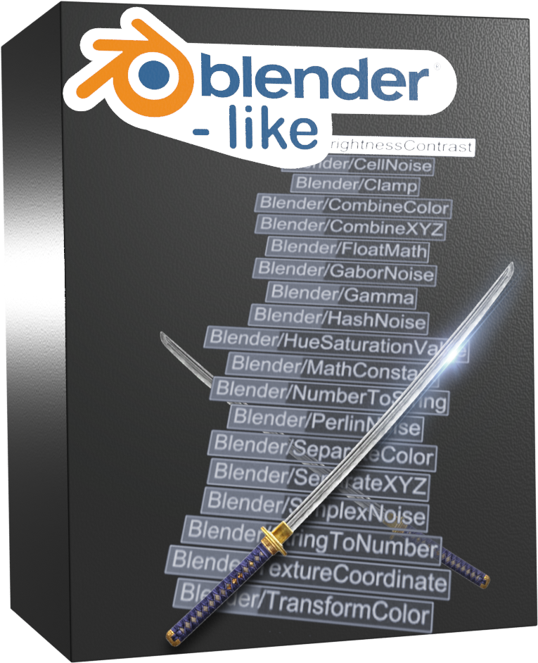

# Katana OSL Shaders

Blender-like OSL shaders for Renderman in Katana.

The PXR shading nodes are missing a lot of basic features, so I made these shaders inspired by Blender's node system.

These are designed to work in Renderman for Katana, and may not work properly in other renderers.
